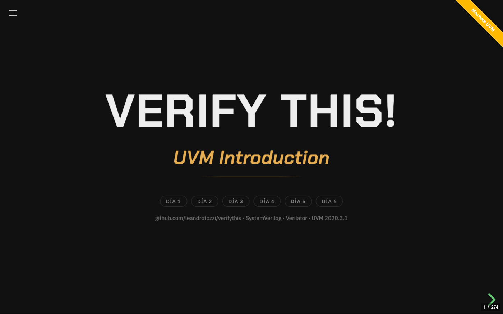
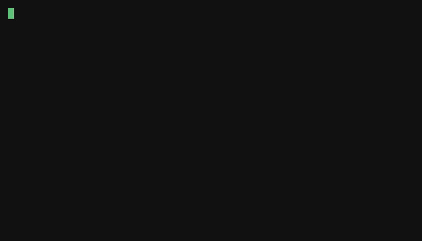

[English](README.md) · **Castellano**

<div align="center">

# Verify This!

### Curso de UVM en español que corre entero con **Verilator**. Sin licencias de EDA.

*Universal Verification Methodology · IEEE 1800.2 · SystemVerilog*

8 unidades en 7 días —más un día 8 opcional— · 444 slides · **38 ejemplos que se ejecutan de verdad**,
con cobertura funcional, sobre el DUT **VTALU**

[](https://github.com/leandrotozzi/verifythis/actions/workflows/build.yml)
[](https://github.com/leandrotozzi/verifythis/actions/workflows/ejemplos.yml)
[](https://verilator.org)
[](https://www.accellera.org/downloads/standards/uvm)
[](#licencia)
[](#empezá-en-60-segundos)
[](https://github.com/leandrotozzi/verifythis/commits/master)

### ▶ [Ver el curso online](https://leandrotozzi.github.io/verifythis/curso.html)

**¿Lo hacés solo?** [Empezá por el libro](https://leandrotozzi.github.io/verifythis/libro/dia1.html) — el mismo curso para leer de corrido, con las notas del instructor adentro del texto

[](https://codespaces.new/leandrotozzi/verifythis)

*Para **correr** los ejemplos sin instalar nada: Verilator, UVM y ccache ya vienen adentro*

[Sitio del curso](https://leandrotozzi.github.io/verifythis/) — temario, cómo correrlo y preguntas frecuentes

[PDF](https://leandrotozzi.github.io/verifythis/curso-uvm.pdf) ·
[PPTX](https://leandrotozzi.github.io/verifythis/curso-uvm.pptx) ·
o cloná el repo y abrí `index.html` con doble clic



</div>

> ## También está entero en inglés — traducido, no pasado por una máquina
>
> Las mismas 444 slides, el mismo libro, los mismos 38 ejemplos y los mismos 15
> ejercicios. `tools/lint-i18n.mjs` compara los dos árboles sección por sección y
> falla si uno se movió y el otro no, así que las dos versiones son el mismo
> curso y no dos cursos parecidos.
>
> **[README in English](README.md)** ·
> [the course](https://leandrotozzi.github.io/verifythis/en/curso.html) ·
> [the book](https://leandrotozzi.github.io/verifythis/en/libro/day1.html)

Casi todo el material de UVM que hay dando vueltas asume Questa, VCS o Xcelium
—licencias que un estudiante no tiene—, y está en inglés. Este curso:

- **Corre con herramientas libres.** Verilator ≥ 5.050 mide cobertura funcional
  (covergroups), que es tema del curso. Qué anda y qué no, ejemplo por ejemplo,
  en [`docs/verilator.md`](docs/verilator.md). No hay flujo Questa.
- **Está en español**, y es un curso de siete días de clase, no una referencia.
- **Se abre con doble clic.** El deck es un archivo, sin servidor ni internet.
- **Es libre de verdad:** MIT el código, CC BY 4.0 las slides. Dictalo,
  adaptalo, cobralo si querés — solo citá la fuente.

<div align="center">

<br>
<sub><code>make u4/tests</code> — UVM 2020.3.1 sobre Verilator, 0 errores, 86,8 % de cobertura funcional</sub>
</div>

---

**Índice** · [Para quién es](#para-quién-es) · [Empezá en 60 segundos](#empezá-en-60-segundos) · [Qué trae](#qué-trae) · [Correr los ejemplos](#correr-los-ejemplos) · [Los ejercicios](#los-ejercicios) · [Si lo dictás](#si-lo-dictás) · [Editarlo](#editarlo) · [Los docs](#los-docs) · [Referencias](#referencias) · [Licencia](#licencia)

---

## Para quién es

Para el que **diseña o verifica RTL** y todavía no escribió un testbench de UVM:
el que viene de un testbench de Verilog con `$display`, el estudiante de una
materia de verificación, el que va a una entrevista donde le van a preguntar qué
hace `uvm_config_db`.

**Qué hay que saber antes:** **Verilog o VHDL**, y haber simulado algo — saber
qué es un `always`, un flanco y un testbench. **Programar orientado a objetos no
hace falta**: el día 2 es exactamente eso, desde cero.

Lo único que el curso da por sabido y no enseña es **SystemVerilog** más allá de
Verilog-2001: el día 1 usa `interface`, `logic`, `enum`, `package`, `covergroup`
y `clocking`. Si venís de VHDL o de Verilog-2001, media hora con
[`docs/systemverilog-para-el-que-viene-de-vhdl.md`](docs/systemverilog-para-el-que-viene-de-vhdl.md)
antes de empezar te ahorra el escalón.

**Qué te llevás:** no "saber UVM" —eso no se aprende en una semana— sino poder
**leer un testbench ajeno, escribir uno propio, y entender la próxima cosa que
aprendas sin que te suene a chino**. La prueba es el capstone: un DUT que no
viste antes, su spec, y el testbench entero desde una hoja en blanco.

Y lo que **no** es: no es una referencia por tema —para eso están
[Verification Academy](https://verificationacademy.com) y el *UVM User Guide*—,
no es un curso de diseño de RTL, y no cubre TLM2, phase jumping ni flujos de
firma. Lo que queda afuera está listado en el cierre, con el link de dónde
seguir.

---

## Empezá en 60 segundos

Sin instalar nada: **[abrilo en Codespaces](https://codespaces.new/leandrotozzi/verifythis)**
—Verilator, UVM, `z3` y ccache ya vienen en la imagen—. O en tu máquina:

```sh
git clone https://github.com/leandrotozzi/verifythis
cd verifythis
make doctor        # ¿esta máquina puede correr el curso? qué falta y cómo se instala
make u4/tests      # UVM sobre Verilator: 0 errores y cobertura funcional, en ~1 min 30
```

Para sólo **leerlo** no hace falta nada: abrí `index.html` con doble clic para el
deck, o `libro/dia1.html` para el libro. Los dos se commitean ya generados, así
que un clon fresco anda sin build y sin internet.

Los ejemplos no los corro yo a mano: el CI corre los 38 ejemplos y las 19
soluciones **en cada release**, y el badge `ejemplos` de arriba dice cómo salió
la última.

<details>
<summary>Atajos del deck</summary>

| Tecla | Acción |
|:--|:--|
| <kbd>i</kbd> | índice del curso: 77 secciones —charlas, repasos, ejercicios y apéndices— agrupadas por día, o el botón ☰ de la esquina superior izquierda |
| <kbd>0</kbd>–<kbd>8</kbd> | ir a la portada / al Día 1–8 (la portada tiene los mismos saltos clickeables, y quedan en la URL: `index.html#/day3`) |
| <kbd>Esc</kbd> | vista general de las 444 slides |
| <kbd>s</kbd> | notas del presentador, en una ventana aparte |
| <kbd>n</kbd> | las mismas notas, abajo de la slide y sin salir de la página (queda recordado) |
| <kbd>v</kbd> | en las slides de repaso, revelar la respuesta sin clickear |
| <kbd>f</kbd> | pantalla completa |
| <kbd>Ctrl</kbd>+<kbd>Shift</kbd>+<kbd>F</kbd> | buscar en el deck |
| <kbd>Ctrl</kbd>/<kbd>⌘</kbd>+<kbd>P</kbd> | imprimir: recarga el deck en la versión clara —la misma del PDF— y abre el diálogo ahí. Al cerrarlo volvés a la slide donde estabas |

El ribbon **"Machete UVM"** de la esquina superior derecha despliega el machete
con los diagramas de referencia del día.

</details>

---

## Qué trae

Ocho unidades, agrupadas por el problema que resuelven, y se dicta en **siete
días**: el día 1 lleva dos unidades cortas y del 2 al 7 hay una unidad por día.
Después hay un **día 8 opcional** —RAL, el modelo de referencia en C por DPI y un
segundo capstone—, que va **después del cierre** porque las tres cosas necesitan
que el capstone del día 7 ya esté hecho.

| Día | Unidad | Secciones | Tiempo |
|:--:|:--|:--|:--:|
| **1** | **1 ·** Por qué se verifica | Tendencias · Qué es UVM · La spec del VTALU · El plan de verificación | ≈ 4 h |
| | **2 ·** El testbench sin UVM | El testbench convencional · Cobertura funcional · Interfaces y BFM | |
| **2** | **3 ·** La OOP que UVM da por sabida | Clases y extensiones · Polimorfismo · Variables y métodos estáticos · Clases paramétricas · El patrón factory · Un testbench sin un solo módulo | ≈ 4 h |
| **3** | **4 ·** Entra UVM | Tests · Components y fases · El env: estructura y estímulo · Reporting | ≈ 4 h 30 |
| **4** | **5 ·** Cómo hablan los componentes | Un productor, muchos oyentes · Un solo lugar que mira el cable · Cuando alguien tiene que esperar · Quién espera a quién | ≈ 4 h |
| **5** | **6 ·** El dato | Copiar un objeto que contiene otro · Transactions · Constrained random | ≈ 4 h 30 |
| **6** | **7 ·** El testbench reutilizable | Agents · Callbacks · Sequences | ≈ 4 h 15 |
| **7** | **8 ·** La otra mitad | Sequences virtuales · Assertions (SVA) · el capstone · los cuatro apéndices · glosario, referencias y cierre | ≈ 5 h 15 |
| **8** *(opc.)* | **9 ·** RAL · y lo que sigue | El modelo de registros sobre el APB del capstone · el modelo de referencia en C por DPI · el segundo capstone: una FIFO con backpressure | ≈ 4 h |

**≈ 34 h 30 de clase**, de las cuales **30 h 30 son los siete días** y el resto el
día 8 opcional. El número no es una promesa: sale de las slides de cada día a
**4 minutos** —con las notas leídas y los ejemplos corridos— más el ejercicio,
medido. Si lo hacés solo, calculá el doble: la mitad se te va en correr las
cosas, y esa mitad es la que enseña.

El **día 7** es el cierre: a la mañana *Assertions*, y a la tarde el **capstone**,
un esclavo APB con su especificación y nada más, donde el testbench se escribe
entero desde una hoja en blanco. Y después los cuatro apéndices: **de la VTALU a
un bus real**, **la caja de herramientas de debug** —las siete perillas, y cuál
usar según el síntoma—, **las 21 trampas mudas** —todo lo que compila,
corre y miente— y un **glosario ES ↔ EN**, porque todo lo que el alumno lea
después de este curso va a estar en inglés.

Cada día cierra con un **repaso**: 58 preguntas en total, que se responden
clickeando. El deck marca en verde la correcta, en rojo la elegida si erró, y
abajo explica el porqué. En el PDF salen ya respondidas.

---

## Correr los ejemplos

El simulador del curso es **Verilator** — libre, sin licencia, y desde la versión
**5.050** mide **cobertura funcional** (covergroups), que es tema del curso. No
hay flujo Questa.

```sh
make doctor          # empezá acá: qué falta en esta máquina y el comando exacto para instalarlo
make u3/tb-en-objetos            # una sección
make                 # los 38 ejemplos (UVM incluido)
make matrix          # idem, y regenera docs/verilator.md
make ejercicios      # las soluciones de code/ejercicios/
```

> [!IMPORTANT]
> **`z3` hace falta desde el día 5.** Verilator resuelve `randomize()` con
> constraints llamando a un solver SMT externo. Sin él, `u5/varios-objetos`,
> `u6/transactions`, `u7/agents` y `u7/sequences` compilan, corren, y
> `randomize()` devuelve 0 sin decir nada. `apt install z3` / `brew install z3`.
> La imagen de Docker y el devcontainer ya lo traen.

**Instalá `ccache` antes de empezar.** Cada simulación se compila a un binario
nativo, y para las secciones con UVM eso son ~2300 archivos C++; con `ccache` en
el `PATH` la segunda compilación baja a ~15 s en cualquier máquina.

Los cuatro caminos para tener el entorno —Codespaces (el que va por defecto),
Docker, Verilator de fuente y WSL 2 en Windows—, más ondas, semillas y la receta
de macOS: **[`docs/instalar.md`](docs/instalar.md)**. Lo que anda y lo que no,
con versión, fecha y el número de cobertura de cada ejemplo:
[`docs/verilator.md`](docs/verilator.md).

### Los ejercicios

**Diecinueve**, en [`code/ejercicios/`](code/ejercicios/): el `run.sh` **falla hasta
que lo resolvés**, y la solución está al lado (`SOLUCION=1 bash run.sh`). Cada
enunciado tiene su versión en inglés (`README.en.md`).

Tres de ellos —`d5b`, `d5c` y `d7-semillas`— son el ciclo de *coverage
closure* hecho con las manos. `d7-final` es el **capstone**: un esclavo APB de
cuatro registros, su especificación, y nada más; el corrector va por etapas, un
`STAGE N OK` cada una. Se entrega con su **plan de verificación** lleno — la
plantilla y el plan del VTALU están en
[`docs/plan-de-verificacion.md`](docs/plan-de-verificacion.md). Los dos
últimos son los de la unidad opcional: `d8-ral`, el mismo DUT con el mapa de
registros de la spec escrito como modelo de UVM, y `d8-fifo`, un segundo
capstone sobre una FIFO con backpressure.

---

## Si lo dictás

El curso está escrito como **siete días**, que es como se dicta en una empresa.

| | Qué es |
|---|---|
| [`docs/para-docentes.md`](docs/para-docentes.md) | El mismo curso como **cuatrimestre de 15 semanas** —2 h de teoría y 2 h de laboratorio por semana—, qué se puede saltear y qué cuesta cada recorte, los dos parciales, y cómo corregir el capstone por etapas |
| [`docs/banco-de-examen.md`](docs/banco-de-examen.md) | Las **58 preguntas sin la respuesta marcada**, con la clave al final. Lo genera `npm run build` desde las mismas slides, así que no se desincroniza |
| [`docs/trampas-mudas.md`](docs/trampas-mudas.md) | Las **21 trampas mudas** —todo lo que compila, corre y miente— y las siete perillas de debug, como página suelta para repartir. También generada |
| [**`docs/machete-uvm.pdf`**](docs/machete-uvm.pdf) | **El machete de una carilla**: la jerarquía de clases, las nueve fases, el handshake del driver y las siete perillas de debug. Para imprimir y pegar al lado del monitor. La fuente es [`res/machete.html`](res/machete.html); `make machete` regenera el PDF |
| [`docs/uvm-en-la-entrevista.md`](docs/uvm-en-la-entrevista.md) | Las preguntas de una entrevista de verificación, cada una con la respuesta corta, el link a la sección y **el ejemplo que corre** |
| [`CITATION.cff`](CITATION.cff) | El botón *Cite this repository* de GitHub, en APA o BibTeX |
| `make regresion` | N semillas, merge de cobertura, y un reporte HTML con los **bins abiertos** |

Y la licencia no tiene asterisco: **CC BY 4.0** el material, **MIT** las
herramientas y **Apache-2.0** el código. Dictalo, adaptalo, traducilo, cobralo —
sólo citá la fuente.

---

## Editarlo

Las slides son Markdown, un archivo por sección, en `slides/es/` (y en
`slides/en/`, la versión en inglés). El código **no se pega** en la slide:
`{{code:...}}` referencia el archivo real de `code/`, así que las slides nunca se
desincronizan de los ejemplos, y si la ruta no existe el build falla.

```sh
npm install       # sólo la primera vez
npm run build     # regenera index.html, en/index.html, libro/ y en/libro/
npm run check     # el gate entero: los generados, más los cuatro linters
```

`index.html` y `libro/` están **commiteados a propósito** —es lo que hace que el
doble clic ande—, así que van en el mismo commit que el cambio en `slides/`, y
`npm run check` falla si te lo olvidaste.

La guía completa —el formato de una slide, las notas del presentador, los
controles de maquetación, la exportación a PDF y PPTX, la tipografía, el árbol
del repo y las decisiones de diseño— está en
[`docs/editar.md`](docs/editar.md). Cómo mandar un cambio:
[`CONTRIBUTING.md`](CONTRIBUTING.md).

**No hace falta saber UVM para ayudar** — el aporte más valioso es el del que
está haciendo el curso por primera vez y se traba: eso es un bug del material, no
suyo.

| | Dónde |
|:--|:--|
| Un typo o un error de contenido | [issue de typo](https://github.com/leandrotozzi/verifythis/issues/new?template=typo.yml) |
| Un ejemplo que no corre | [issue de ejemplo](https://github.com/leandrotozzi/verifythis/issues/new?template=ejemplo.yml) — con la versión de Verilator, el SO y la salida |
| Una duda de un ejercicio | [Discussions](https://github.com/leandrotozzi/verifythis/discussions), que tiene una categoría por día |

---

## Los docs

Todo lo que no entra en una slide, indexado en
**[`docs/README.md`](docs/README.md)**: la matriz de Verilator, el machete, la
guía para docentes, el plan de verificación, el banco de examen, las trampas
mudas, las preguntas de entrevista, la nivelación de SystemVerilog para el que
viene de VHDL, qué cambia el día que te sentás frente a Questa, y los dos textos
largos de fondo (clocking blocks, y en qué se diferencia del *UVM Primer*).

## Referencias

- **IEEE 1800-2017** — SystemVerilog Language Reference Manual
- **IEEE 1800.2** / **Accellera UVM** — la metodología y el *UVM User Guide*
- **Verification Academy** — Siemens EDA · [verificationacademy.com](https://verificationacademy.com)
- **Salemi, Ray.** [*The UVM Primer.*](https://www.amazon.com/UVM-Primer-Step-Step-Introduction/dp/0974164933)
  Boston Light Press, 2013 · ISBN 978-0974164939. — el libro con el que aprendí
  UVM, y del que derivan varios de los ejemplos de `code/`. Este curso **no es
  ese libro**: tiene otra estructura, otro DUT, otro simulador y cuatro unidades
  de material que el libro no cubre. La lista completa está en
  [`docs/en-que-se-diferencia.md`](docs/en-que-se-diferencia.md).
- **2024 Siemens EDA / Wilson Research Group Functional Verification Study** —
  los **datos** de la Unidad 1. Los gráficos son propios (`res/trends/`).

## Licencia

| Qué | Licencia |
|:--|:--|
| Herramientas (`tools/`, `css/`, `js/`, `.github/`) | [MIT](LICENSES/MIT.txt) |
| Ejemplos y ejercicios (`code/`) | [Apache-2.0](code/LICENSE) + [`NOTICE`](NOTICE) |
| Contenido del curso (`slides/`, `docs/`) | [CC BY 4.0](https://creativecommons.org/licenses/by/4.0/) |

Usalo, adaptalo, dictalo — incluso comercialmente — citando la fuente:

> "Verify This! — Curso introductorio a UVM", por Leandro Tozzi ·
> https://github.com/leandrotozzi/verifythis · CC BY 4.0

**Se puede forkear sin consultar a nadie.** Parte de `code/` deriva de los
ejemplos del *UVM Primer*, que su autor publicó bajo Apache-2.0; por eso `code/`
está bajo Apache-2.0 y no MIT. Lo único que la licencia pide a cambio es
conservar el [`NOTICE`](NOTICE), que acredita el origen y lista los cambios.
Lo de terceros —reveal.js, forkit.js, las tipografías— está en la sección del
[`LICENSING.md`](LICENSING.md), que es el mapa de las tres licencias.
