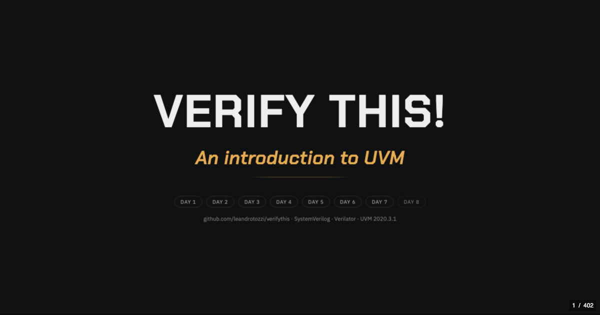

<!-- es-sha: 09e582917fea -->
**English** · [Castellano](README.es.md)

<div align="center">

# Verify This!

### A free **UVM tutorial**: a SystemVerilog verification course that runs end to end on **Verilator**. No EDA licences.

*Universal Verification Methodology · IEEE 1800.2 · SystemVerilog · open source EDA*

8 units over 7 days —plus an optional day 8— · 402 slides · **38 examples that really run**,
with functional coverage, on the **VTALU** DUT

[](https://github.com/leandrotozzi/verifythis/actions/workflows/build.yml)
[](https://github.com/leandrotozzi/verifythis/actions/workflows/ejemplos.yml)
[](https://verilator.org)
[](https://www.accellera.org/downloads/standards/uvm)
[](#licence)
[](#start-in-60-seconds)
[](https://github.com/leandrotozzi/verifythis/commits/master)

### ▶ [Take the course online](https://leandrotozzi.github.io/verifythis/en/curso.html)

**Studying on your own?** [Start with the book](https://leandrotozzi.github.io/verifythis/en/libro/day1.html) — the same course to read straight through, with the instructor notes inside the text

[](https://codespaces.new/leandrotozzi/verifythis)

*To **run** the examples without installing anything: Verilator, UVM and ccache are already inside*

[Course site](https://leandrotozzi.github.io/verifythis/en/) — syllabus, how to run it, FAQ

[PDF](https://leandrotozzi.github.io/verifythis/uvm-course.pdf) ·
[PPTX](https://leandrotozzi.github.io/verifythis/uvm-course.pptx) ·
or clone the repo and open `en/index.html` with a double click



</div>

> ## Also available in Spanish — the complete course, not a summary
>
> The whole thing exists twice: the same 402 slides, the same book, the same 38
> examples and the same 15 exercises, written in Spanish rather than
> machine-translated. Almost every other UVM course is English-only, so if you
> read Spanish this is very likely the only complete one there is.
>
> **[README en castellano](README.es.md)** ·
> [el curso](https://leandrotozzi.github.io/verifythis/curso.html) ·
> [el libro](https://leandrotozzi.github.io/verifythis/libro/dia1.html)

Most UVM material out there assumes Questa, VCS or Xcelium — licences a student
does not have. This course:

- **Runs on free tools.** Verilator ≥ 5.050 measures functional coverage
  (covergroups), which the course teaches. What works and what does not, example
  by example, in [`docs/verilator.md`](docs/verilator.md). There is no Questa flow.
- **Is a course, not a reference.** Seven days of class, in order, with an
  exercise at the end of each one.
- **Opens with a double click.** The deck is one file: no server, no internet.
- **Is actually free:** MIT for the tools, Apache-2.0 for the code, CC BY 4.0 for
  the slides. Teach it, adapt it, charge for it — just cite the source.

<div align="center">

<br>
<sub><code>make u4/tests</code> — UVM 2020.3.1 on Verilator, 0 errors, 86.8% functional coverage</sub>
</div>

---

**Index** · [Start in 60 seconds](#start-in-60-seconds) · [What is in it](#what-is-in-it) · [Run the examples](#run-the-examples) · [The exercises](#the-exercises) · [Teaching it](#teaching-it) · [Editing it](#editing-it) · [Docs](#docs) · [References](#references) · [Licence](#licence)

---

## Start in 60 seconds

Nothing to install: **[open it in Codespaces](https://codespaces.new/leandrotozzi/verifythis)**
— Verilator, UVM, `z3` and ccache are already in the image. Or, on your own machine:

```sh
git clone https://github.com/leandrotozzi/verifythis
cd verifythis
make doctor        # can this machine run the course? what is missing, and how to install it
make u4/tests      # UVM on Verilator: 0 errors and functional coverage, in ~1 min 30
```

To just **read** the course, nothing is needed at all: open `en/index.html` with a
double click for the deck, or `en/libro/day1.html` for the book. Both are
committed already built, so a fresh clone works offline.

The examples are not run by hand: CI runs the 38 examples and the 15 solutions
every night, and the `examples` badge above says whether they are green **now**.

<details>
<summary>Deck keyboard shortcuts</summary>

| Key | Action |
|:--|:--|
| <kbd>i</kbd> | course index: 70 sections —talks, quizzes, exercises and appendices— grouped by day, or the ☰ button in the top left corner |
| <kbd>0</kbd>–<kbd>8</kbd> | jump to the cover / to Day 1–8 (the cover has the same clickable jumps, and they end up in the URL: `en/index.html#/day3`) |
| <kbd>Esc</kbd> | overview of all 402 slides |
| <kbd>s</kbd> | speaker notes, in a separate window |
| <kbd>n</kbd> | the same notes, below the slide and without leaving the page (remembered) |
| <kbd>v</kbd> | on quiz slides, reveal the answer without clicking |
| <kbd>f</kbd> | full screen |
| <kbd>Ctrl</kbd>+<kbd>Shift</kbd>+<kbd>F</kbd> | search the deck |
| <kbd>Ctrl</kbd>/<kbd>⌘</kbd>+<kbd>P</kbd> | print: reloads the deck in the light theme —the same one the PDF uses— and opens the dialog there. Closing it puts you back on the slide you were on |

The **"Machete UVM"** ribbon in the top right corner opens the cheat sheet with
the reference diagrams for the day.

</details>

---

## What is in it

Eight units, grouped by the problem they solve, taught over **seven days**: day 1
carries two short units, days 2 to 7 one unit each. Then an **optional day 8**
—RAL, a C reference model over DPI and a second capstone— which comes **after the
closing** because all three need the day 7 capstone to be done already.

| Day | Unit | Sections | Time |
|:--:|:--|:--|:--:|
| **1** | **1 ·** Why we verify | Trends · What UVM is · The VTALU spec · The verification plan | ≈ 4 h |
| | **2 ·** The testbench without UVM | The conventional testbench · Functional coverage · Interfaces and BFMs | |
| **2** | **3 ·** The OOP that UVM takes for granted | Classes and extensions · Polymorphism · Static variables and methods · Parameterised classes · The factory pattern · A testbench without a single module | ≈ 4 h |
| **3** | **4 ·** Enter UVM | Tests · Components and phases · The env: structure and stimulus · Reporting | ≈ 4 h 30 |
| **4** | **5 ·** How components talk | One producer, many listeners · One single place that watches the wire · When somebody has to wait · Who waits for whom | ≈ 4 h |
| **5** | **6 ·** The data | Copying an object that contains another · Transactions · Constrained random | ≈ 4 h |
| **6** | **7 ·** The reusable testbench | Agents · Callbacks · Sequences · Virtual sequences | ≈ 5 h 15 |
| **7** | **8 ·** The other half | Assertions (SVA) · the capstone · the four appendices · glossary, references and closing | ≈ 4 h 45 |
| **8** *(opt.)* | **9 ·** RAL · and what comes next | The register model over the capstone's APB · the C reference model over DPI · the second capstone: a FIFO with backpressure | ≈ 4 h |

**≈ 34 h 30 of class**, of which **30 h 30 are the seven days** and the rest is the
optional day 8. The number is not a promise: it comes from each day's slides at
**4 minutes** —notes read out and examples actually run— plus the exercise,
measured. Doing it alone, count on double: half the time goes into running
things, and that half is the half that teaches.

Day 7 is the closing: *Assertions* in the morning, and in the afternoon the
**capstone** — an APB slave with a spec and nothing else, where the testbench is
written from a blank page. Then the four appendices: **from the VTALU to a real
bus**, **the debug toolbox** (the seven knobs, and which one to turn for which
symptom), **the 21 silent traps** —everything that compiles, runs and lies— and
an **ES ↔ EN glossary**, because everything a student reads after this course is
going to be in English.

Each day ends with a **quiz**: 45 questions in total, answered by clicking. The
deck marks the right one green, the wrong choice red, and explains why
underneath. In the PDF they come already answered.

---

## Run the examples

The simulator is **Verilator** — free, no licence, and since **5.050** it measures
**functional coverage** (covergroups), which the course teaches.

```sh
make doctor          # start here: what is missing on this machine, and the exact install command
make u3/tb-en-objetos            # one section
make                 # all 38 examples (UVM included)
make matrix          # the same, and regenerates docs/verilator.md
make ejercicios      # the solutions in code/ejercicios/
```

> [!IMPORTANT]
> **`z3` is required from day 5 on.** Verilator solves `randomize()` with
> constraints by calling an external SMT solver. Without it, `u5/varios-objetos`,
> `u6/transactions`, `u7/agents` and `u7/sequences` compile, run, and
> `randomize()` returns 0 without saying a word. `apt install z3` /
> `brew install z3`. The Docker image and the devcontainer already ship it.

**Install `ccache` before you start.** Every simulation compiles to a native
binary, and the UVM sections are ~2300 C++ files; with `ccache` on the `PATH` the
second build drops to ~15 s on any machine.

Four ways to get a working setup — Codespaces (the default), Docker, building
Verilator from source, and WSL 2 on Windows — plus waveforms, seeds and the
macOS recipe: **[`docs/en/setup.md`](docs/en/setup.md)**. What runs and what
does not, with version, date and the coverage number of each example:
[`docs/verilator.md`](docs/verilator.md) *(in Spanish)*.

### The exercises

**Fifteen**, in [`code/ejercicios/`](code/ejercicios/): `run.sh` **fails until you
solve it**, and the solution sits next to it (`SOLUCION=1 bash run.sh`). Every
statement has an English version (`README.en.md`).

Three of them —`d5b`, `d6-bins` and `d6-semillas`— are the *coverage closure*
loop done by hand. `d7-final` is the **capstone**: a four-register APB slave, its
spec, and nothing else; the marker goes in stages, one `STAGE N OK` each. It is
handed in with its **verification plan** filled out — the template and the VTALU
plan are in [`docs/plan-de-verificacion.md`](docs/plan-de-verificacion.md)
*(in Spanish)*. The last two belong to the optional unit: `d8-ral`, the same DUT
with the spec's register map written as a UVM model, and `d8-fifo`, a second
capstone on a FIFO with backpressure.

---

## Teaching it

The course is written as **seven days**, which is how it is taught in a company.

| | What it is |
|---|---|
| [`docs/en/for-teachers.md`](docs/en/for-teachers.md) | The same course as a **15-week term** —2 h theory + 2 h lab a week—, what can be cut and what each cut costs, the two midterms, and how to mark the capstone in stages |
| [`docs/en/exam-bank.md`](docs/en/exam-bank.md) | The **45 questions without the answer marked**, key at the end. Generated from the same slides, so it cannot drift |
| [`docs/en/silent-traps.md`](docs/en/silent-traps.md) | The **21 silent traps** —everything that compiles, runs and lies— and the seven debug knobs, as a loose page to hand out. Also generated |
| [`docs/en/uvm-interview.md`](docs/en/uvm-interview.md) | The questions a verification interview asks, each with the short answer, the link to the section and **the example that runs** |
| [**`docs/machete-uvm.pdf`**](docs/machete-uvm.pdf) | **The one-page cheat sheet**: the class hierarchy, the nine phases, the driver handshake and the seven debug knobs. To print and stick next to the monitor |
| [`CITATION.cff`](CITATION.cff) | GitHub's *Cite this repository* button, in APA or BibTeX |
| `make regresion` | N seeds, coverage merge, and an HTML report with the **open bins** |

The licence has no asterisk: **CC BY 4.0** for the material, **MIT** for the
tools, **Apache-2.0** for the code. Teach it, adapt it, translate it, charge for
it — just cite the source.

---

## Editing it

The slides are Markdown, one file per section, in `slides/es/` (and `slides/en/`,
the English version). Code is **never pasted** into a slide: `{{code:...}}`
references the real file in `code/`, so the slides cannot drift from the
examples, and the build fails if the path does not exist.

```sh
npm install       # first time only
npm run build     # regenerates index.html, en/index.html, libro/ and en/libro/
npm run check     # the whole gate: the generated files, plus the four linters
```

`index.html` and `libro/` are **committed on purpose** —that is what makes the
double click work— so they go in the same commit as the change to `slides/`, and
`npm run check` fails if you forgot.

The full authoring guide —slide format, speaker notes, layout controls, PDF and
PPTX export, typography, the repo tree and the design decisions— is in
[`docs/editar.md`](docs/editar.md) *(in Spanish)*. How to send a change:
[`CONTRIBUTING.md`](CONTRIBUTING.md) *(in Spanish)*.

**You do not need to know UVM to help.** The most valuable report is from
somebody taking the course for the first time who got stuck: that is a bug in the
material, not in them.

| | Where |
|:--|:--|
| A typo or a content error | [typo issue](https://github.com/leandrotozzi/verifythis/issues/new?template=typo.yml) |
| An example that does not run | [example issue](https://github.com/leandrotozzi/verifythis/issues/new?template=ejemplo.yml) — with the Verilator version, the OS and the output |
| A question about an exercise | [Discussions](https://github.com/leandrotozzi/verifythis/discussions), one category per day |

---

## Docs

Everything that does not fit on a slide, indexed in
**[`docs/README.md`](docs/README.md)**: the Verilator matrix, the cheat sheet, the
teaching guide, the verification plan, the exam bank, the silent traps, the
interview questions, and the two long background pieces (clocking blocks, and how
this differs from the *UVM Primer*). Five of them exist in English and are
indexed in [`docs/en/`](docs/en/README.md) — setup, the interview questions, the
teaching guide, and the two generated appendices. The rest is in Spanish, and
every link to one says so.

## References

- **IEEE 1800-2017** — SystemVerilog Language Reference Manual
- **IEEE 1800.2** / **Accellera UVM** — the methodology and the *UVM User Guide*
- **Verification Academy** — Siemens EDA · [verificationacademy.com](https://verificationacademy.com)
- **Salemi, Ray.** [*The UVM Primer.*](https://www.amazon.com/UVM-Primer-Step-Step-Introduction/dp/0974164933)
  Boston Light Press, 2013 · ISBN 978-0974164939 — the book I learned UVM from,
  and several of the examples in `code/` derive from it. This course **is not that
  book**: different structure, different DUT, different simulator, and four units
  of material the book does not cover. Full list in
  [`docs/en-que-se-diferencia.md`](docs/en-que-se-diferencia.md) *(in Spanish)*.
- **2024 Siemens EDA / Wilson Research Group Functional Verification Study** — the
  **data** behind Unit 1. The charts are ours (`res/trends/`).

## Licence

| What | Licence |
|:--|:--|
| Tools (`tools/`, `css/`, `js/`, `.github/`) | [MIT](LICENSE) |
| Examples and exercises (`code/`) | [Apache-2.0](code/LICENSE) + [`NOTICE`](NOTICE) |
| Course content (`slides/`, `docs/`) | [CC BY 4.0](https://creativecommons.org/licenses/by/4.0/) |

Use it, adapt it, teach it — commercially too — citing the source:

> "Verify This! — Curso introductorio a UVM", by Leandro Tozzi ·
> https://github.com/leandrotozzi/verifythis · CC BY 4.0

**Fork it without asking anybody.** Part of `code/` derives from the *UVM Primer*
examples, which their author published under Apache-2.0; that is why `code/` is
Apache-2.0 and not MIT. All the licence asks in return is that you keep the
[`NOTICE`](NOTICE), which credits the origin and lists the changes. Third-party
material —reveal.js, forkit.js, the typefaces— is covered in the corresponding
section of [`LICENSE`](LICENSE).
