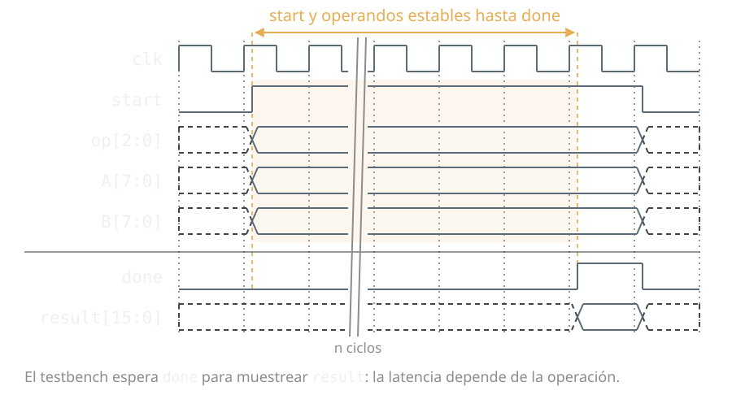

<div align="center">

# Verify This!

### Curso de UVM en español que corre entero con **Verilator**. Sin licencias de EDA.

*Universal Verification Methodology · IEEE 1800.2 · SystemVerilog*

8 unidades en 7 días —más un día 8 opcional— · 400 slides · **38 ejemplos que se ejecutan de verdad**,
con cobertura funcional, sobre el DUT **VTALU**

[](https://github.com/leandrotozzi/verifythis/actions/workflows/build.yml)
[](https://github.com/leandrotozzi/verifythis/actions/workflows/ejemplos.yml)
[](https://verilator.org)
[](https://www.accellera.org/downloads/standards/uvm)
[](#licencia)
[](#ver-el-curso)

### ▶ [Ver el curso online](https://leandrotozzi.github.io/verifythis/curso.html)

**¿Lo hacés solo?** [Empezá por el libro](https://leandrotozzi.github.io/verifythis/libro/dia1.html) — el mismo curso para leer de corrido, con las notas del instructor adentro del texto

[](https://codespaces.new/leandrotozzi/verifythis)

*Para **correr** los ejemplos sin instalar nada: Verilator, UVM y ccache ya vienen adentro*

[Sitio del curso](https://leandrotozzi.github.io/verifythis/) — temario, cómo correrlo y preguntas frecuentes

[PDF](https://leandrotozzi.github.io/verifythis/curso-uvm.pdf) ·
[PPTX](https://leandrotozzi.github.io/verifythis/curso-uvm.pptx) ·
o cloná el repo y abrí `index.html` con doble clic


</div>

> **In English —** *Verify This!* is a **Spanish-language UVM course**: seven days
> plus an optional eighth, 8 units, 400 slides, 38 runnable examples and
> 15 self-checking exercises.
> It **runs entirely on Verilator** — no EDA licenses, no account, no signup: clone
> the repo, or open the deck with a double click.
> **The English version is live**, published one day at a time as each one lands:
> [leandrotozzi.github.io/verifythis/en/](https://leandrotozzi.github.io/verifythis/en/)
> — **day 1 is complete**. The code, the exercises and the diagrams are already
> English and shared by both versions, so every example runs as it is; only the
> slides get rewritten. Order and progress: [`ROADMAP.md`](ROADMAP.md).

Casi todo el material de UVM que hay dando vueltas asume Questa, VCS o Xcelium
—licencias que un estudiante no tiene—, y está en inglés. Este curso:

- **Corre con herramientas libres.** Verilator ≥ 5.050 mide cobertura funcional
  (covergroups), que es tema del curso. Qué anda y qué no, ejemplo por ejemplo,
  en [`docs/verilator.md`](docs/verilator.md). No hay flujo Questa.
- **Está en español**, y es un curso de siete días de clase, no una referencia.
- **Se abre con doble clic.** El deck es un archivo, sin servidor ni internet.
- **Es libre de verdad:** MIT el código, CC BY 4.0 las slides. Dictalo,
  adaptalo, cobralo si querés — solo citá la fuente.

<div align="center">

<br>
<sub><code>make u4/tests</code> — UVM 2020.3.1 sobre Verilator, 0 errores, 86,8 % de cobertura funcional</sub>
</div>

---

## Ver el curso

**[Online](https://leandrotozzi.github.io/verifythis/curso.html)**, o **abrí `index.html` con
doble clic**: sin servidor, sin internet, sin instalar nada.

### O leerlo, si estudiás solo

`libro/dia1.html` … `dia7.html` es **el mismo curso para leer de corrido**. Un
deck no se lee: se mira mientras alguien habla. El libro pone en el texto lo que
ese alguien diría —

- la **nota del presentador va inline**, como prosa, en vez de esconderse detrás
  de la tecla <kbd>s</kbd>. Ahí está la mitad del curso;
- el **código va completo**: la sección muestra el mismo recorte que la slide, y
  abajo hay un `<details>` con el archivo entero;
- los **repasos siguen siendo clickeables**, con el mismo markup del deck;
- cada sección enlaza a su slide, y tiene su propio `id` para poder mandarle a
  alguien una sola.

Sale de las mismas `slides/`, con `npm run libro` —que ya corre dentro de
`npm run build`—, y `npm run check` falla si quedó viejo. Tema claro por defecto,
porque esto se lee largo.

`index.html` se commitea ya generado, con las slides y los 151 bloques de código
embebidos —leídos de los archivos reales de `code/`—. Un clon fresco funciona tal
cual.

<details>
<summary>Otras formas de levantarlo</summary>

```sh
python3 -m http.server      # http://localhost:8000
npm start                   # servidor + rebuild automático al editar
```

</details>

### Atajos

| Tecla | Acción |
|:--|:--|
| <kbd>i</kbd> | índice del curso: 70 entradas —secciones, repasos, ejercicios y apéndices— agrupadas por día, o el botón ☰ de la esquina superior izquierda |
| <kbd>0</kbd>–<kbd>8</kbd> | ir a la portada / al Día 1–8 (la portada tiene los mismos saltos clickeables, y quedan en la URL: `index.html#/day3`) |
| <kbd>Esc</kbd> | vista general de las 400 slides |
| <kbd>s</kbd> | notas del presentador, en una ventana aparte |
| <kbd>n</kbd> | las mismas notas, abajo de la slide y sin salir de la página (queda recordado) |
| <kbd>v</kbd> | en las slides de repaso, revelar la respuesta sin clickear |
| <kbd>f</kbd> | pantalla completa |
| <kbd>Ctrl</kbd>+<kbd>Shift</kbd>+<kbd>F</kbd> | buscar en el deck |
| <kbd>Ctrl</kbd>/<kbd>⌘</kbd>+<kbd>P</kbd> | imprimir: recarga el deck en la versión clara —la misma del PDF— y abre el diálogo ahí. Al cerrarlo volvés a la slide donde estabas |

El ribbon **"Machete UVM"** de la esquina superior derecha despliega el machete
con los diagramas de referencia del día.

---

## Contenido

El curso tiene **ocho unidades**, agrupadas por el problema que resuelven, y se
dicta en **siete días**: el día 1 lleva dos unidades cortas y del 2 al 7 hay una
unidad por día. Después hay un **día 8 opcional** —RAL, el modelo de referencia
en C por DPI y un segundo capstone—, que va **después del cierre** porque las
tres cosas necesitan que el capstone del día 7 ya esté hecho.

| Día | Unidad | Secciones | Tiempo |
|:--:|:--|:--|:--:|
| **1** | **1 ·** Por qué se verifica | Tendencias · Qué es UVM · La spec del VTALU · El plan de verificación | ≈ 4 h |
| | **2 ·** El testbench sin UVM | El testbench convencional · Cobertura funcional · Interfaces y BFM | |
| **2** | **3 ·** La OOP que UVM da por sabida | Clases y extensiones · Polimorfismo · Variables y métodos estáticos · Clases paramétricas · El patrón factory · Un testbench sin un solo módulo | ≈ 4 h |
| **3** | **4 ·** Entra UVM | Tests · Components y fases · El env: estructura y estímulo · Reporting | ≈ 4 h 30 |
| **4** | **5 ·** Cómo hablan los componentes | Un productor, muchos oyentes · Un solo lugar que mira el cable · Cuando alguien tiene que esperar · Quién espera a quién | ≈ 4 h |
| **5** | **6 ·** El dato | Copiar un objeto que contiene otro · Transactions · Constrained random | ≈ 4 h |
| **6** | **7 ·** El testbench reutilizable | Agents · Callbacks · Sequences · Sequences virtuales | ≈ 5 h 15 |
| **7** | **8 ·** La otra mitad | Assertions (SVA) · el capstone · los cuatro apéndices · glosario, referencias y cierre | ≈ 4 h 45 |
| **8** *(opc.)* | **9 ·** RAL · y lo que sigue | El modelo de registros sobre el APB del capstone · el modelo de referencia en C por DPI · el segundo capstone: una FIFO con backpressure | ≈ 4 h |

**≈ 34 h 30 de clase**, de las cuales **30 h 30 son los siete días** y el resto el día 8 opcional. El número no es una promesa: sale de las slides de cada
día a **4 minutos** —con las notas leídas y los ejemplos corridos— más el
ejercicio, medido. Si lo hacés solo, calculá el doble: la mitad se te va en
correr las cosas, y esa mitad es la que enseña.

El **día 7** es la otra mitad de la verificación y el cierre del curso: a la
mañana la unidad 8 —*Assertions*— con su ejercicio y su repaso; a la tarde el
**capstone**, un esclavo APB con su especificación y nada más, donde el
testbench se escribe entero desde una hoja en blanco. Y después los cuatro
apéndices: **de la VTALU a un bus real** —qué cambia y qué no cuando la interface
es AXI o APB—, **la caja de herramientas de debug** —las siete perillas del
curso, y cuál usar según el síntoma—, **las diecinueve trampas mudas** —todo lo
que compila, corre y miente— y un **glosario ES ↔ EN**, porque todo lo que el
alumno lea después de este curso va a estar en inglés.

El **día 8 es opcional y va después del cierre**, y las dos cosas son a
propósito: las tres piezas que trae —**RAL** sobre el mismo APB del capstone, el
**modelo de referencia en C por DPI**, y un **segundo capstone** con una FIFO con
backpressure— necesitan que el capstone del día 7 ya esté hecho. RAL reemplaza el
scoreboard que el alumno acaba de escribir; el golden model en C reemplaza su
predicción; y el segundo capstone sólo enseña algo para el que ya entregó el
primero, porque lo que muestra es **dónde deja de servir el patrón del primero**.
El que termina el día 7 no le debe nada al curso.

Cada día cierra con un **repaso** de 5 preguntas — 10 el día 6, 8 el día 2, 7 el día 3 y 6 el día 1, que son los más cargados; 4 el día 5. **45 en total.** Se responde clickeando la
opción: el deck marca en verde la correcta, en rojo la elegida si erró, y abajo
explica el porqué. En el PDF salen ya respondidas.

En `slides/` la correcta se marca con la sintaxis de lista de tareas de
Markdown, así que reordenar las opciones nunca la deja mintiendo:

```markdown
<!-- .slide: class="quiz" -->

**¿Pregunta?**

- [ ] Una opción incorrecta
- [x] La correcta

> **El gist** — por qué.
```

---

## Si lo dictás

El curso está escrito como **siete días**, que es como se dicta en una empresa.
[**`docs/para-docentes.md`**](docs/para-docentes.md) lo pasa a un **cuatrimestre
de 15 semanas** —2 h de teoría y 2 h de laboratorio por semana—, dice qué se
puede saltear y qué cuesta cada recorte, y qué evaluar en cada parcial.

| | Qué es |
|---|---|
| [`docs/para-docentes.md`](docs/para-docentes.md) | El mapa de 15 semanas, los dos parciales, y cómo corregir el capstone por etapas |
| [`docs/banco-de-examen.md`](docs/banco-de-examen.md) | Las **45 preguntas sin la respuesta marcada**, con la clave al final. Lo genera `npm run build` desde las mismas slides, así que no se desincroniza |
| [`docs/trampas-mudas.md`](docs/trampas-mudas.md) | Las **19 trampas mudas** —todo lo que compila, corre y miente— y las siete perillas de debug, como página suelta para repartir. También generada, desde el apéndice del día 7 |
| [**`docs/machete-uvm.pdf`**](docs/machete-uvm.pdf) | **El machete de una carilla**: la jerarquía de clases, las nueve fases, el handshake del driver y las siete perillas de debug. Para imprimir y pegar al lado del monitor. La fuente es [`res/machete.html`](res/machete.html), que se abre con doble clic; `make machete` regenera el PDF |
| [`docs/uvm-en-la-entrevista.md`](docs/uvm-en-la-entrevista.md) | Las preguntas de una entrevista de verificación, cada una con la respuesta corta, el link a la sección y **el ejemplo que corre** |
| [`CITATION.cff`](CITATION.cff) | El botón *Cite this repository* de GitHub, en APA o BibTeX |
| `make ejercicios` | Corre las 14 **soluciones**: verifica que sigan siendo resolubles después de tocar el código del curso |
| `make regresion` | N semillas, merge de cobertura, y un reporte HTML con los **bins abiertos** |

Y la licencia no tiene asterisco: **CC BY 4.0** el material, **MIT** las
herramientas y **Apache-2.0** el código. Dictalo, adaptalo, traducilo, cobralo —
sólo citá la fuente.

---

## Editar

Las slides son Markdown, un archivo por sección, en `slides/es/` (y en
`slides/en/`, la versión en inglés). El prefijo
numérico define el orden; dentro de cada archivo, `---` entre líneas en blanco
separa una slide de la siguiente.

```
slides/es/000-verify-this.md
slides/es/010-tendencias.md
slides/es/030-interfaces-bfm.md
```

### Incluir código

El código **no se pega** en la slide: se referencia el archivo real de `code/`.

```markdown
## 3. Interfaces y BFM

- SV interface agrupa signals y permite modelar BFMs

{{code:code/u2/interfaces-bfm/vtalu_bfm.sv}}
{{code:code/u2/interfaces-bfm/top.sv|lines=12-24}}
```

`tools/build.mjs` expande la directiva leyendo el archivo, así que las slides
nunca se desincronizan de los ejemplos. **Si la ruta no existe, el build falla**
en vez de emitir una slide vacía.

<div align="center">

<br>
<sub>El resaltado es propio: highlight.js no trae gramática de SystemVerilog y usaba
la de Verilog-95, que dejaba sin pintar las macros <code>`uvm_*</code> y las clases <code>uvm_*</code></sub>
</div>

### Notas del presentador

`Note:` al principio de una línea, y lo que sigue hasta el final de la slide son
notas: no se ven en pantalla, salen con <kbd>s</kbd>, y `dist/slides.md` las
convierte en notas del orador del `.pptx`.

```markdown
- Un bullet telegráfico

Note:
Lo que hay que decir y no entra en la slide: el porqué del dato, la analogía que
engancha, la trampa clásica.
```

Van en las slides que cargan el concepto, no en las 400. `npm run check` corre
`tools/lint-slides.mjs`, que **falla** si una slide con `{{code:}}` no tiene ni un
bullet ni una `Note:` —una slide de código muda sólo se entiende con el
instructor al lado—, y avisa si un `{{code:}}` sin `lines=` trae más de 35 líneas.

### Ajustes de presentación

El layout se acomoda solo: los bloques de código toman el espacio que sobra y
scrollean, las imágenes escalan, y una slide con demasiado texto reduce su
tipografía hasta entrar. Para los casos que necesitan una mano, hay tres
controles, opt-in uno por uno:

| Clase | Dónde | Para qué |
|:--|:--|:--|
| `grande` | imagen | Le reserva más alto. Un `` se dibuja a su tamaño nativo, así que un diagrama chico queda ilegible. |
| `fondo-blanco` | imagen | Para PNG de trazo negro y fondo transparente, que sobre el `#111` del tema no se ven. Hoy no lo usa ninguna slide —las figuras son SVG temados y la única foto trae su propio fondo—, queda por si entra un screenshot. |
| `codigo-grande` | slide | Sube el cuerpo del código, donde leerlo importa más que evitar el scroll. |

```markdown

<!-- .element: class="grande" -->
```

Atributos de reveal.js con la sintaxis de comentario habitual:

```markdown
<!-- .slide: id="day2" data-transition="concave" -->
Un párrafo que aparece después
<!-- .element: class="fragment" -->
```

### Después de editar

```sh
npm install       # sólo la primera vez
npm run build     # regenera index.html, dist/slides.md y libro/
npm run overflow  # verifica que ninguna slide se recorte
npm run inventario  # cuántos ejemplos, slides, secciones… hay ahora
```

### Los números del curso no se escriben a mano

*"400 slides"*, *"38 ejemplos"*, *"15 ejercicios"* aparecen repartidos en **más
de veinticinco lugares** —el README, la landing, el `CITATION.cff`, el
`Makefile`, los workflows, los docs y las propias slides—, y agregar una slide
los desactualizaba todos en silencio.

`tools/inventario.mjs` es el **único lugar que sabe contar**: saca los nueve
números del filesystem, así que un ejemplo, una slide o una pregunta nuevos se
cuentan solos. `npm run check` compara **cada número escrito en el repo** contra
ese inventario y falla si alguno miente — en dígitos (`38 ejemplos`) y en letras
(`quince soluciones`), incluso partido por un salto de línea.

No están centralizados con plantillas a propósito. El README, la landing y el
`CITATION.cff` **no son archivos generados**, y volverlos generados para no
repetir un número deja un README que no se puede leer en crudo. Así la prosa
sigue siendo prosa, y el que miente falla en CI.

`npm run inventario` los imprime, si necesitás escribir uno nuevo en algún lado.

> El chequeo cruza saltos de línea a propósito, porque la prosa del repo va a 80
> columnas y *"las 45\npreguntas"* es exactamente el caso que hay que atajar. El
> precio es que **no se escriben listados de estos números a mano** — para eso
> está el comando.

> [!IMPORTANT]
> Commiteá `index.html` y `libro/` junto con el cambio en `slides/` — es lo que
> hace que el deck y el libro funcionen sin build. `npm run check` falla si te lo
> olvidaste, y corre en CI.

`npm run overflow` recorre las 400 slides en Chrome headless y falla si alguna no
entra en el canvas de 1100×700, tanto en pantalla como en la maquetación del PDF.
Es la red que garantiza que ninguna diapositiva salga cortada.

---

## Exportar

```sh
npm run pdf     # dist/curso-uvm.pdf   — el deck en claro, para imprimir
npm run pptx    # dist/curso-uvm.pptx  — texto editable
```

| | PDF | PPTX |
|:--|:--|:--|
| **Cómo** | Chrome headless sobre `?print-pdf` | pandoc |
| **Fidelidad** | mismo layout, paleta clara | deck limpio, *no* reproduce el tema |
| **Editable** | no | sí, texto y bullets reales |
| **Páginas** | 440 (los archivos largos fluyen a varias páginas en vez de recortarse) | 1 por slide |

El PDF **se puede imprimir**, y es también lo que sale con <kbd>Ctrl</kbd>+<kbd>P</kbd>
desde el deck: papel blanco, tinta oscura, el código sobre una
plancha gris tenue y las 40 figuras en paleta clara —las genera
`tools/figs-print.mjs` en `res/print/`, porque un SVG referenciado con ``
es un documento aparte y no lo alcanza el CSS de la página—. El ámbar y el
verde siguen siendo los dos colores-señal del curso, oscurecidos hasta pasar
4,5:1 contra el papel. En pantalla el deck sigue siendo oscuro.

Requisitos: Chrome o Chromium para el PDF, [pandoc](https://pandoc.org) para el
PPTX. Para ajustar el estilo del PPTX, creá una plantilla:
`pandoc -o tools/reference.pptx --print-default-data-file reference.pptx`

---

## Correr los ejemplos

El simulador del curso es **Verilator** — libre, sin licencia, y desde la
versión **5.050** mide **cobertura funcional** (covergroups), que es tema del
curso. No hay flujo Questa: los `run.do` y el DUT en VHDL se sacaron del repo.

```sh
make doctor          # ¿esta máquina puede correr el curso? qué falta y cómo se instala
make u3/tb-en-objetos            # una sección
make                 # los 38 ejemplos (UVM incluido)
make matrix          # idem, y regenera docs/verilator.md
make ejercicios      # las soluciones de code/ejercicios/
```

**Empezá por `make doctor`.** No compila nada: mira que haya Verilator ≥ 5.050,
`z3`, `ccache` y el resto, y para lo que falte imprime el comando exacto de tu
gestor de paquetes. Existe porque los dos modos de falla más caros del curso son
**mudos** —sin `z3`, `randomize()` devuelve 0 sin decir nada; con un Verilator
anterior a 5.050, la cobertura funcional reporta 0 % sin una advertencia—, así
que un alumno puede perder una tarde antes de sospechar de la instalación.

> [!IMPORTANT]
> **`z3` hace falta desde el día 5.** Verilator resuelve `randomize()` con
> constraints llamando a un solver SMT externo. Sin él, `u5/varios-objetos`, `u6/transactions`, `u7/agents` y
> `u7/sequences` compilan, corren, y `randomize()` devuelve 0 sin decir nada.
> `apt install z3` / `brew install z3`. La imagen de Docker y el devcontainer ya
> lo traen.

**Instalá `ccache` antes de empezar.** Cada simulación se compila a un binario
nativo, y para las secciones con UVM eso son ~2300 archivos C++. Con `ccache` en
el `PATH`, `common.sh` exporta `OBJCACHE` solo y la segunda compilación no vuelve
a hacer el trabajo. Medido sobre `make u4/tests` con Verilator 5.052:

| | 12 cores | 2 cores (Codespaces gratis) |
|---|--:|--:|
| la primera vez | ~1 min 30 | ~4 min |
| con el `obj_dir` borrado y `ccache` tibio | ~15 s | ~15 s |

Un hit de `ccache` es copiar un archivo, así que la segunda compilación tarda lo
mismo en cualquier máquina: lo caro se paga una vez. Lo que la cache **no** hace
es acelerar la sección de al lado — Verilator renombra los símbolos por diseño y
apenas el 22 % de los archivos coinciden entre dos secciones.

Y para repetir una corrida al azar, `SEED=N`:

```sh
SEED=7 make u7/sequences     # pasa +verilator+seed+7; run_sim imprime la semilla que usó
```

Para mirar ondas con **GTKWave** —Verilator las genera gratis— hay un opt-in:

```sh
cd code/u2/convencional && VLT_TRACE=1 bash run.sh && gtkwave vtalu.vcd
```

`VLT_TRACE=1` agrega el `--trace` de Verilator y prende el `$dumpfile`/`$dumpvars`
del top, que está detrás de un `` `ifdef `` porque sin el flag no compilaría.

`make` baja **UVM 2020.3.1** (Accellera `uvm-core`, la implementación de
referencia de IEEE 1800.2-2020) a `code/.uvm/` la primera vez. Cada ejemplo
tiene su `run.sh`; los flags comunes están en `code/verilator/common.sh`.

Un ejemplo **pasa** si compila, corre, sale con código 0 y su *Report Summary*
de UVM cierra en 0 `UVM_ERROR`. El único opt-out es `u4/reporting`, que rompe el
scoreboard a propósito para poder enseñar reporting.

### Ejercicios

**Catorce**, en [`code/ejercicios/`](code/ejercicios/): el `run.sh` **falla hasta
que lo resolvés**, y la solución está al lado (`SOLUCION=1 bash run.sh`). Cada
directorio tiene sólo los archivos que se tocan; el resto del testbench sale del
sección, por referencia.

Tres de ellos —`d5b`, `d6-bins` y `d6-semillas`— son el ciclo de *coverage
closure* hecho con las manos: medir una distribución, escribir el caso dirigido
que llena el bin que falta, y acumular cobertura con una regresión de cinco
semillas.

El decimotercero, `d7-final`, es el **capstone**: un esclavo APB de cuatro registros,
su especificación, y **nada más**. El testbench se escribe entero, desde una
hoja en blanco, y el corrector va por etapas — monitor, driver, scoreboard y
cobertura, un `STAGE N OK` cada uno. Se entrega con su **plan de verificación**
lleno: las cinco columnas, la plantilla y el plan del VTALU como ejemplo están en
**[`docs/plan-de-verificacion.md`](docs/plan-de-verificacion.md)**.

El último, `d8-ral`, es el de la unidad opcional y va después del capstone: el
mismo DUT y el mismo testbench, con el mapa de registros de la spec escrito como
modelo de UVM. Su segunda etapa la corrigen dos sequences de `uvm-core` que nadie
escribió.

Los ejemplos **los corre el CI**, no sólo yo: cada push que toque `code/` corre
los que no usan UVM (segundos) más `u4/tests`, y todas las noches corren los 38 más
las 15 soluciones de los ejercicios. El badge de arriba dice si están en verde
ahora, no en la fecha en que alguien los corrió a mano.

Lo que anda y lo que no —con versión, fecha y el número de cobertura de cada
ejemplo— está en **[`docs/verilator.md`](docs/verilator.md)**. Los dos agujeros
que quedan: los *bins de transición* (`=>`) todavía no compilan, y `binsof` /
`intersect` en un cross se ignoran.

### Sin instalar nada: Codespaces

[](https://codespaces.new/leandrotozzi/verifythis)

**Es el camino por defecto.** `.devcontainer/` trae Verilator, UVM y ccache ya
adentro, así que el botón —o **Code ▸ Codespaces ▸ Create codespace**— deja el
curso corriendo en el navegador, desde cualquier máquina. Las cuentas gratuitas
traen 60 horas-core por mes, de sobra para los siete días.

Va primero porque en macOS y en Windows instalar Verilator ≥ 5.050 es media
tarde de trabajo que no enseña nada de UVM. Si tenés Linux con un Verilator
reciente, saltá a la tercera.

### Con Docker, en tu máquina

La misma imagen del devcontainer, con el repo montado desde afuera: editás con
tu editor de siempre y corrés adentro.

```sh
docker build -t verifythis .                              # una vez, ~7 min
docker run --rm -it -v "$PWD":/work verifythis make u4/tests
```

La cache de `ccache` vive en `.ccache/` del repo montado —por eso sobrevive al
`--rm`—. Detalles, ajuste de RAM y limitaciones en [`docs/docker.md`](docs/docker.md).

### A mano: Verilator ≥ 5.050

En Linux, el paquete de la distro suele estar atrasado: mirá `verilator --version`
antes de nada. En macOS Intel, Homebrew ya no compila fórmulas nuevas, así que va
de fuente. La receta que funciona (las tres trampas están en los `PATH`):

```sh
brew install m4 bison ccache z3   # el bison de macOS es 2.3, Verilator pide 3.x
git clone --depth 1 --branch v5.052 https://github.com/verilator/verilator
cd verilator
# m4 y bison de brew; flex NO: el de brew genera contra otro FlexLexer.h y no linkea
export PATH="/usr/local/opt/m4/bin:/usr/local/opt/bison/bin:$PATH"
autoconf && ./configure --prefix="$HOME/opt/verilator-5.052"
make -j"$(sysctl -n hw.ncpu)" && make install
```

Después, `$HOME/opt/verilator-5.052/bin` adelante en el `PATH`.

Los otros dos paquetes de esa línea no son adorno:

- **`z3`** es **obligatorio** desde el día 5. Verilator resuelve `randomize()`
  con constraints llamando a un solver SMT externo; sin él la compilación pasa,
  la simulación corre, y `randomize()` devuelve 0 — otra que no rompe, miente.
  Lo necesitan `u5/varios-objetos`, `u6/transactions`, `u7/agents` y `u7/sequences`.
- **`ccache`** lo detecta solo `common.sh`, y es lo que hace que el segundo
  sección con UVM compile en segundos.

<details>
<summary>En Windows: WSL 2</summary>

Una vez instalado Ubuntu, todo lo demás es idéntico a Linux.

```powershell
wsl --install -d Ubuntu     # PowerShell como administrador, y reiniciar
```

Adentro de Ubuntu, `sudo apt install git make g++ perl ccache z3` y después
Verilator de fuente, con la receta de arriba.

> [!IMPORTANT]
> Cloná el repo **dentro del sistema de archivos de WSL** (`~/verifythis`), no en
> `/mnt/c/...`. El puente a NTFS hace que la compilación de UVM tarde varias
> veces más.

Para las ondas: en Windows 11, WSLg abre GTKWave directo. En Windows 10, instalá
GTKWave nativo y abrí el `.vcd` desde `\\wsl$\Ubuntu\home\...`.

Docker Desktop también funciona, con el mismo `Dockerfile`.

</details>

### Si no podés ni eso

[EDA Playground](https://edaplayground.com) sirve para pegar una clase suelta y
experimentar con un concepto —polimorfismo, una `constraint`, un `covergroup`—.
No corre el curso entero, porque los testbenches son de muchos archivos, pero es
la red de seguridad del que hoy no puede instalar nada. Y sus simuladores
comerciales soportan los *bins de transición* que Verilator todavía no.

Cada ejemplo es **autocontenido a propósito**: podés copiar `code/u4/env/` a otro
lado y correrlo tal cual. Ver [`code/README.md`](code/README.md).

---

## Cómo está armado

```
slides/           fuente de verdad de las slides (Markdown)
  es/             el curso en castellano: una seccion por archivo
  en/             el mismo curso en ingles, un dia por vez
code/             ejemplos SystemVerilog, un directorio por sección
  ejercicios/     uno por día: el run.sh falla hasta que lo resolvés
docs/             verilator.md (qué anda y qué no), docker.md, el plan de
                  verificación —las cinco columnas, el del VTALU y la
                  plantilla—, para-docentes.md y banco-de-examen.md (GENERADO)
res/              imágenes, diagramas y las figuras de tendencias (generadas)
css/              tema del curso + fuentes vendorizadas
  code.css        tema de los bloques de código (reemplaza a monokai)
tools/
  doctor.sh       ¿esta máquina corre el curso? qué falta y cómo se instala
  inventario.mjs  el único lugar que sabe cuántos ejemplos, slides, secciones,
                  ejercicios, preguntas, días, figuras y trampas hay
  build.mjs       slides/<idioma>/ + code/  →  index.html + dist/slides.md
  i18n.mjs        los textos que no salen de slides/: titulos, dias, la UI
  lint-i18n.mjs   que slides/en/ no diverja de slides/es/, ni en estructura
                  ni en sentido (cada traduccion lleva el sha de su original)
                  + docs/banco-de-examen.md y docs/trampas-mudas.md
  template.html   shell de reveal.js (config, atajos, machete)
  libro.mjs       slides/<idioma>/ + code/  ->  libro/diaN.html (las notas, inline)
  overflow.mjs    verifica que ninguna slide se recorte
  lint-slides.mjs slides mudas, includes largos sin lines=, y el estilo de los
                  titulos (### y subtitulos sin italica)
  lint-refs.mjs   comandos, capitulos y links que ya no existen, y cada numero
                  del inventario contra el filesystem
  regresion.sh    N semillas + merge de cobertura
  regresion.mjs   el reporte HTML, con los bins que quedaron abiertos
  trends.mjs      res/trends/data.json  →  res/trends/*.svg
  vendor.mjs      vendoriza reveal.js desde node_modules
  hljs-slim.mjs   los 6 lenguajes del deck, en vez de los ~190 de highlight.js
  hljs-sv.mjs     gramática propia de SystemVerilog + UVM (hljs no trae una)
  fonts.mjs       vendoriza las fuentes desde Google Fonts
vendor/reveal/    reveal.js 5.2.1 pinneado (build UMD, para que ande en file://)
web/              la landing del sitio: temario, como correrlo y FAQ, en HTML
                  plano. El deck no le da a un buscador una linea que indexar,
                  asi que la raiz de GitHub Pages es esto y el deck queda en
                  /curso.html
index.html        GENERADO — no editar a mano
libro/            GENERADO — el curso para leer de corrido, un HTML por dia
```

Tres dependencias (`reveal.js`, `highlight.js`, `esbuild`), y sólo para poder
regenerar `vendor/`. Las herramientas usan únicamente builtins de Node.

<details>
<summary>Decisiones de diseño</summary>

- **Build UMD, no ESM.** Chrome bloquea módulos ESM sobre `file://` por CORS, y
  eso mataría el requisito de abrir con doble clic.
- **Fuentes vendorizadas.** Nada de CDN: el deck abre sin internet. Y `system-ui`
  no sirve porque cambia de máquina en máquina — el deck se vería distinto en el
  proyector que en la notebook.
- **`index.html` commiteado.** Un clon fresco anda sin build; Node sólo hace falta
  para editar.
- **Resaltado propio.** highlight.js no tiene SystemVerilog: usaba el de
  Verilog-95, que no conoce clases ni macros, así que en un curso de UVM dejaba
  sin pintar justo lo que el curso enseña. `tools/hljs-sv.mjs` lo reemplaza, y
  las categorías de UVM se reconocen **por patrón** (`` `uvm_* ``, `uvm_*`,
  `UVM_*`): no hay lista que se desactualice. De paso el bundle bajó de 45,0 a
  41,9 KB, porque la gramática propia pesa menos que la que sacó.
- **Duplicación intencional en `code/`.** `vtalu_bfm.sv` y compañía se repiten
  entre secciones porque cada sección muestra su propia versión a medida que el
  testbench evoluciona. No es duplicación a limpiar.

</details>

---

## Tipografía

**Chakra Petch** en los títulos — display angular, de terminales cortadas, que
rima con el tema: trazas, silicio, herramientas de EDA. **IBM Plex Sans** en el
cuerpo y **IBM Plex Mono** en el código.

Las tres están vendorizadas en `css/fonts/` (subset latino, 160 KB).
`npm run fonts` las vuelve a bajar si cambiás de tipografía.

> Un requisito no obvio al elegirlas: casi todos los subtítulos del curso van en
> *itálica*, así que la fuente de títulos necesita itálica real. Una que no la
> tenga —las condensadas suelen no tenerla— el browser la falsea inclinándola.

---

## Referencias

- **IEEE 1800-2017** — SystemVerilog Language Reference Manual
- **IEEE 1800.2** / **Accellera UVM** — la metodología y el *UVM User Guide*
- **Verification Academy** — Siemens EDA · [verificationacademy.com](https://verificationacademy.com)
- **Salemi, Ray.** [*The UVM Primer.*](https://www.amazon.com/UVM-Primer-Step-Step-Introduction/dp/0974164933)
  Boston Light Press, 2013 · ISBN 978-0974164939. — el libro con el que aprendí
  UVM, y del que derivan varios de los ejemplos de `code/`. Este curso **no es
  ese libro**: tiene otra estructura, otro DUT, otro simulador y cuatro unidades
  de material que el libro no cubre. La lista completa está en
  [`docs/en-que-se-diferencia.md`](docs/en-que-se-diferencia.md).
- **2024 Siemens EDA / Wilson Research Group Functional Verification Study** —
  los **datos** de la Unidad 1. Los gráficos son propios (`res/trends/`).

## Cómo colaborar

Un typo, un ejemplo que no corre en tu máquina, una explicación que no se
entiende: las tres cosas se arreglan igual de rápido y las tres las agradezco.
**No hace falta saber UVM para ayudar** — el aporte más valioso es el del que
está haciendo el curso por primera vez y se traba.

| | Dónde |
|:--|:--|
| Un typo o un error de contenido | [issue de typo](https://github.com/leandrotozzi/verifythis/issues/new?template=typo.yml) |
| Un ejemplo que no corre | [issue de ejemplo](https://github.com/leandrotozzi/verifythis/issues/new?template=ejemplo.yml) — con la versión de Verilator, el SO y la salida |
| Una duda de un ejercicio | [Discussions](https://github.com/leandrotozzi/verifythis/discussions), que tiene una categoría por día |
| Un cambio, en un PR | [`CONTRIBUTING.md`](CONTRIBUTING.md) |
| Algo grande, de lo que ya está planeado | [`ROADMAP.md`](ROADMAP.md) — las fases, en orden, con archivo y línea |

Lo único que no se puede saltear está en dos líneas: `npm run build && npm run
check && npm run overflow` en verde, y `index.html` + `libro/` commiteados en el
mismo commit que el cambio en `slides/`. Están generados, y son lo que hace que
el curso ande con doble clic.

## Licencia

| Qué | Licencia |
|:--|:--|
| Herramientas (`tools/`, `css/`, `js/`, `.github/`) | [MIT](LICENSE) |
| Ejemplos y ejercicios (`code/`) | [Apache-2.0](code/LICENSE) + [`NOTICE`](NOTICE) |
| Contenido del curso (`slides/`, `docs/`) | [CC BY 4.0](https://creativecommons.org/licenses/by/4.0/) |

Usalo, adaptalo, dictalo — incluso comercialmente — citando la fuente:

> "Verify This! — Curso introductorio a UVM", por Leandro Tozzi ·
> https://github.com/leandrotozzi/verifythis · CC BY 4.0

**Se puede forkear sin consultar a nadie.** Parte de `code/` deriva de los
ejemplos del *UVM Primer*, que su autor publicó bajo Apache-2.0; por eso `code/`
está bajo Apache-2.0 y no MIT. Lo único que la licencia pide a cambio es
conservar el [`NOTICE`](NOTICE), que acredita el origen y lista los cambios.
Lo de terceros —reveal.js, forkit.js, las tipografías— está en la sección del
[`LICENSE`](LICENSE).
