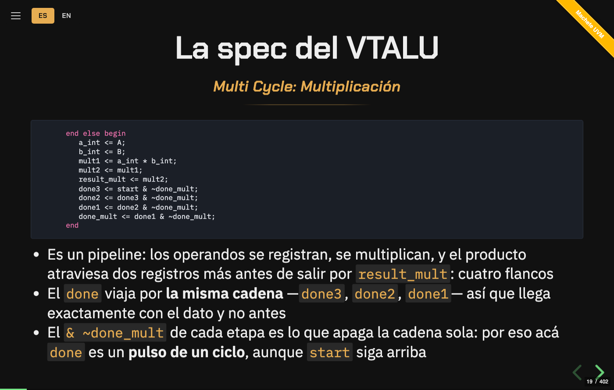

# Editar el curso

Lo que hace falta para tocar el material y que el build siga en verde. Es lo que
estaba en el README hasta que se lo acortó para que el que llega pueda decidir en
treinta segundos: acá está entero, sin recortar.

Cómo mandar un cambio: [`../CONTRIBUTING.md`](../CONTRIBUTING.md).

---

## Las slides

Las slides son Markdown, un archivo por sección, en `slides/es/` (y en
`slides/en/`, la versión en inglés). El prefijo
numérico define el orden; dentro de cada archivo, `---` entre líneas en blanco
separa una slide de la siguiente.

```
slides/es/000-verify-this.md
slides/es/010-tendencias.md
slides/es/030-interfaces-bfm.md
```

### Incluir código

El código **no se pega** en la slide: se referencia el archivo real de `code/`.

```markdown
## 3. Interfaces y BFM

- SV interface agrupa signals y permite modelar BFMs

{{code:code/u2/interfaces-bfm/vtalu_bfm.sv}}
{{code:code/u2/interfaces-bfm/vtalu_bfm.sv#send_op}}
{{code:code/u2/clocking/mezcla.sv#two-reads}}
```

`tools/codigo.mjs` expande la directiva leyendo el archivo —el deck y el libro
usan **la misma** implementación—, así que las slides nunca se desincronizan de
los ejemplos. **Si la ruta no existe, el build falla** en vez de emitir una slide
vacía.

### Recortar: por nombre, no por número

Un `|lines=12-24` se pudre en silencio: cuando el ejemplo crece arriba del
bloque, el rango no se mueve y la slide muestra otro código. Los cuatro lints
pasan en verde y nadie se entera hasta que alguien lo ve en cámara. Por eso el
recorte va **por nombre**, y el nombre sale de dos lados:

1. **Del propio SystemVerilog.** `#write`, `#scoreboard`, `#cmd_monitor`: la
   declaración y su `end*`, con los comentarios pegados arriba. No hay nada que
   agregar al fuente — el bloque ya está delimitado y ya tiene nombre. Si el
   nombre está dos veces en el archivo, el build lo dice y se desambigua con
   `#clase.metodo`.
2. **De un marcador**, para el trozo que el lenguaje no nombra —medio `initial`,
   un `fork`/`join`, tres líneas sueltas:

   ```systemverilog
   // cb: two-reads
   por_cb  = bfm.cb.d_out;
   por_mod = bfm.d_out;
   // cb: end
   ```

   Los marcadores se borran de todo bloque emitido, así que anidan sin problema y
   la slide nunca muestra metadata del build.

Si el nombre no está, está dos veces o no cierra, **el build muere y dice qué
slide**. Nunca miente. `npm run lint` avisa de cualquier `lines=` que quede, con
una excepción: las salidas capturadas (`.txt`, `.log`), que `tools/regen-outputs.sh`
reescribe enteras y no pueden llevar un marcador adentro.

<div align="center">

<br>
<sub>El resaltado es propio: highlight.js no trae gramática de SystemVerilog y usaba
la de Verilog-95, que dejaba sin pintar las macros <code>`uvm_*</code> y las clases <code>uvm_*</code></sub>
</div>

### Los repasos

Cada día cierra con un **repaso** de 5 preguntas — 10 el día 6, 8 el día 2, 7 el día 3 y 6 el día 1, que son los más cargados; 4 el día 5. **45 en total.** Se responde clickeando la
opción: el deck marca en verde la correcta, en rojo la elegida si erró, y abajo
explica el porqué. En el PDF salen ya respondidas.

En `slides/` la correcta se marca con la sintaxis de lista de tareas de
Markdown, así que reordenar las opciones nunca la deja mintiendo:

```markdown
<!-- .slide: class="quiz" -->

**¿Pregunta?**

- [ ] Una opción incorrecta
- [x] La correcta

> **El gist** — por qué.
```

### Notas del presentador

`Note:` al principio de una línea, y lo que sigue hasta el final de la slide son
notas: no se ven en pantalla, salen con <kbd>s</kbd>, y `dist/slides.md` las
convierte en notas del orador del `.pptx`.

```markdown
- Un bullet telegráfico

Note:
Lo que hay que decir y no entra en la slide: el porqué del dato, la analogía que
engancha, la trampa clásica.
```

Van en las slides que cargan el concepto, no en las 400. `npm run check` corre
`tools/lint-slides.mjs`, que **falla** si una slide con `{{code:}}` no tiene ni un
bullet ni una `Note:` —una slide de código muda sólo se entiende con el
instructor al lado—, y avisa si un `{{code:}}` sin recortar trae más de 35 líneas
o si quedó un recorte por número de línea.

### Ajustes de presentación

El layout se acomoda solo: los bloques de código toman el espacio que sobra y
scrollean, las imágenes escalan, y una slide con demasiado texto reduce su
tipografía hasta entrar. Para los casos que necesitan una mano, hay tres
controles, opt-in uno por uno:

| Clase | Dónde | Para qué |
|:--|:--|:--|
| `grande` | imagen | Le reserva más alto. Un `` se dibuja a su tamaño nativo, así que un diagrama chico queda ilegible. |
| `fondo-blanco` | imagen | Para PNG de trazo negro y fondo transparente, que sobre el `#111` del tema no se ven. Hoy no lo usa ninguna slide —las figuras son SVG temados y la única foto trae su propio fondo—, queda por si entra un screenshot. |
| `codigo-grande` | slide | Sube el cuerpo del código, donde leerlo importa más que evitar el scroll. |

```markdown

<!-- .element: class="grande" -->
```

Atributos de reveal.js con la sintaxis de comentario habitual:

```markdown
<!-- .slide: id="day2" data-transition="concave" -->
Un párrafo que aparece después
<!-- .element: class="fragment" -->
```

### Después de editar

```sh
npm install       # sólo la primera vez
npm run build     # regenera index.html, dist/slides.md y libro/
npm run overflow  # verifica que ninguna slide se recorte
npm run inventario  # cuántos ejemplos, slides, secciones… hay ahora
```

### Los números del curso no se escriben a mano

*"402 slides"*, *"38 ejemplos"*, *"15 ejercicios"* aparecen repartidos en **más
de veinticinco lugares** —el README, la landing, el `CITATION.cff`, el
`Makefile`, los workflows, los docs y las propias slides—, y agregar una slide
los desactualizaba todos en silencio.

`tools/inventario.mjs` es el **único lugar que sabe contar**: saca los nueve
números del filesystem, así que un ejemplo, una slide o una pregunta nuevos se
cuentan solos. `npm run check` compara **cada número escrito en el repo** contra
ese inventario y falla si alguno miente — en dígitos (`38 ejemplos`) y en letras
(`quince soluciones`), incluso partido por un salto de línea.

No están centralizados con plantillas a propósito. El README, la landing y el
`CITATION.cff` **no son archivos generados**, y volverlos generados para no
repetir un número deja un README que no se puede leer en crudo. Así la prosa
sigue siendo prosa, y el que miente falla en CI.

`npm run inventario` los imprime, si necesitás escribir uno nuevo en algún lado.

> El chequeo cruza saltos de línea a propósito, porque la prosa del repo va a 80
> columnas y *"las 45\npreguntas"* es exactamente el caso que hay que atajar. El
> precio es que **no se escriben listados de estos números a mano** — para eso
> está el comando.

> [!IMPORTANT]
> Commiteá `index.html` y `libro/` junto con el cambio en `slides/` — es lo que
> hace que el deck y el libro funcionen sin build. `npm run check` falla si te lo
> olvidaste, y corre en CI.

`npm run overflow` recorre las 402 slides en Chrome headless y falla si alguna no
entra en el canvas de 1100×700, tanto en pantalla como en la maquetación del PDF.
Es la red que garantiza que ninguna diapositiva salga cortada.

---

## Exportar

```sh
npm run pdf     # dist/curso-uvm.pdf   — el deck en claro, para imprimir
npm run pptx    # dist/curso-uvm.pptx  — texto editable
```

| | PDF | PPTX |
|:--|:--|:--|
| **Cómo** | Chrome headless sobre `?print-pdf` | pandoc |
| **Fidelidad** | mismo layout, paleta clara | deck limpio, *no* reproduce el tema |
| **Editable** | no | sí, texto y bullets reales |
| **Páginas** | 440 (los archivos largos fluyen a varias páginas en vez de recortarse) | 1 por slide |

El PDF **se puede imprimir**, y es también lo que sale con <kbd>Ctrl</kbd>+<kbd>P</kbd>
desde el deck: papel blanco, tinta oscura, el código sobre una
plancha gris tenue y las 40 figuras en paleta clara —las genera
`tools/figs-print.mjs` en `res/print/`, porque un SVG referenciado con ``
es un documento aparte y no lo alcanza el CSS de la página—. El ámbar y el
verde siguen siendo los dos colores-señal del curso, oscurecidos hasta pasar
4,5:1 contra el papel. En pantalla el deck sigue siendo oscuro.

Requisitos: Chrome o Chromium para el PDF, [pandoc](https://pandoc.org) para el
PPTX. Para ajustar el estilo del PPTX, creá una plantilla:
`pandoc -o tools/reference.pptx --print-default-data-file reference.pptx`

---

## El libro

`libro/dia1.html` … `dia8.html` es **el mismo curso para leer de corrido**. Un
deck no se lee: se mira mientras alguien habla. El libro pone en el texto lo que
ese alguien diría —

- la **nota del presentador va inline**, como prosa, en vez de esconderse detrás
  de la tecla <kbd>s</kbd>. Ahí está la mitad del curso;
- el **código va completo**: la sección muestra el mismo recorte que la slide, y
  abajo hay un `<details>` con el archivo entero;
- los **repasos siguen siendo clickeables**, con el mismo markup del deck;
- cada sección enlaza a su slide, y tiene su propio `id` para poder mandarle a
  alguien una sola.

Sale de las mismas `slides/`, con `npm run libro` —que ya corre dentro de
`npm run build`—, y `npm run check` falla si quedó viejo. Tema claro por defecto,
porque esto se lee largo.

`index.html` se commitea ya generado, con las slides y los 154 bloques de código
embebidos —leídos de los archivos reales de `code/`—. Un clon fresco funciona tal
cual.

<details>
<summary>Otras formas de levantarlo</summary>

```sh
python3 -m http.server      # http://localhost:8000
npm start                   # servidor + rebuild automático al editar
```

</details>

---

## Tipografía

**Chakra Petch** en los títulos — display angular, de terminales cortadas, que
rima con el tema: trazas, silicio, herramientas de EDA. **IBM Plex Sans** en el
cuerpo y **IBM Plex Mono** en el código.

Las tres están vendorizadas en `css/fonts/` (subset latino, 160 KB).
`npm run fonts` las vuelve a bajar si cambiás de tipografía.

> Un requisito no obvio al elegirlas: casi todos los subtítulos del curso van en
> *itálica*, así que la fuente de títulos necesita itálica real. Una que no la
> tenga —las condensadas suelen no tenerla— el browser la falsea inclinándola.

---

## Cómo está armado

```
slides/           fuente de verdad de las slides (Markdown)
  es/             el curso en castellano: una seccion por archivo
  en/             el mismo curso en ingles, un dia por vez
code/             ejemplos SystemVerilog, un directorio por sección
  ejercicios/     uno por día: el run.sh falla hasta que lo resolvés
docs/             verilator.md (qué anda y qué no), docker.md, el plan de
                  verificación —las cinco columnas, el del VTALU y la
                  plantilla—, para-docentes.md y banco-de-examen.md (GENERADO)
res/              imágenes, diagramas y las figuras de tendencias (generadas)
css/              tema del curso + fuentes vendorizadas
  code.css        tema de los bloques de código (reemplaza a monokai)
tools/
  doctor.sh       ¿esta máquina corre el curso? qué falta y cómo se instala
  inventario.mjs  el único lugar que sabe cuántos ejemplos, slides, secciones,
                  ejercicios, preguntas, días, figuras y trampas hay
  build.mjs       slides/<idioma>/ + code/  →  index.html + dist/slides.md
  i18n.mjs        los textos que no salen de slides/: titulos, dias, la UI
  lint-i18n.mjs   que slides/en/ no diverja de slides/es/, ni en estructura
                  ni en sentido (cada traduccion lleva el sha de su original)
                  + docs/banco-de-examen.md y docs/trampas-mudas.md
  template.html   shell de reveal.js (config, atajos, machete)
  libro.mjs       slides/<idioma>/ + code/  ->  libro/diaN.html (las notas, inline)
  codigo.mjs      la directiva {{code:}}: una implementacion para el deck y el libro
  overflow.mjs    verifica que ninguna slide se recorte
  lint-slides.mjs slides mudas, includes largos, recortes por numero de linea,
                  y el estilo de los titulos (### y subtitulos sin italica)
  lint-refs.mjs   comandos, capitulos y links que ya no existen, y cada numero
                  del inventario contra el filesystem
  regresion.sh    N semillas + merge de cobertura
  regresion.mjs   el reporte HTML, con los bins que quedaron abiertos
  trends.mjs      res/trends/data.json  →  res/trends/*.svg
  vendor.mjs      vendoriza reveal.js desde node_modules
  hljs-slim.mjs   los 6 lenguajes del deck, en vez de los ~190 de highlight.js
  hljs-sv.mjs     gramática propia de SystemVerilog + UVM (hljs no trae una)
  fonts.mjs       vendoriza las fuentes desde Google Fonts
vendor/reveal/    reveal.js 5.2.1 pinneado (build UMD, para que ande en file://)
web/              la landing del sitio: temario, como correrlo y FAQ, en HTML
                  plano. El deck no le da a un buscador una linea que indexar,
                  asi que la raiz de GitHub Pages es esto y el deck queda en
                  /curso.html
index.html        GENERADO — no editar a mano
libro/            GENERADO — el curso para leer de corrido, un HTML por dia
```

Tres dependencias (`reveal.js`, `highlight.js`, `esbuild`), y sólo para poder
regenerar `vendor/`. Las herramientas usan únicamente builtins de Node.

<details>
<summary>Decisiones de diseño</summary>

- **Build UMD, no ESM.** Chrome bloquea módulos ESM sobre `file://` por CORS, y
  eso mataría el requisito de abrir con doble clic.
- **Fuentes vendorizadas.** Nada de CDN: el deck abre sin internet. Y `system-ui`
  no sirve porque cambia de máquina en máquina — el deck se vería distinto en el
  proyector que en la notebook.
- **`index.html` commiteado.** Un clon fresco anda sin build; Node sólo hace falta
  para editar.
- **Resaltado propio.** highlight.js no tiene SystemVerilog: usaba el de
  Verilog-95, que no conoce clases ni macros, así que en un curso de UVM dejaba
  sin pintar justo lo que el curso enseña. `tools/hljs-sv.mjs` lo reemplaza, y
  las categorías de UVM se reconocen **por patrón** (`` `uvm_* ``, `uvm_*`,
  `UVM_*`): no hay lista que se desactualice. De paso el bundle bajó de 45,0 a
  41,9 KB, porque la gramática propia pesa menos que la que sacó.
- **Duplicación intencional en `code/`.** `vtalu_bfm.sv` y compañía se repiten
  entre secciones porque cada sección muestra su propia versión a medida que el
  testbench evoluciona. No es duplicación a limpiar.

</details>
